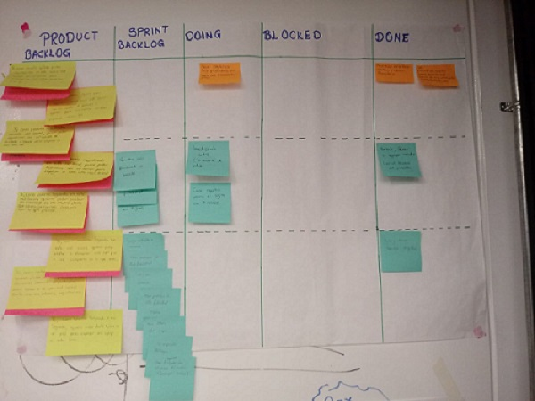
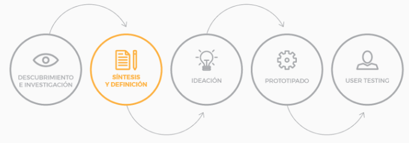
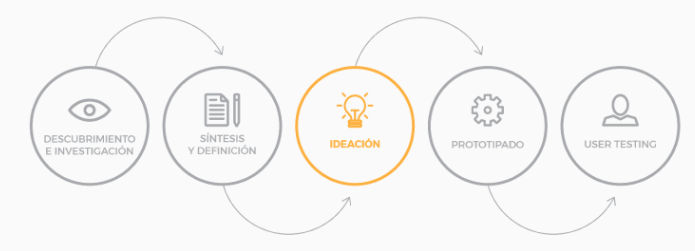
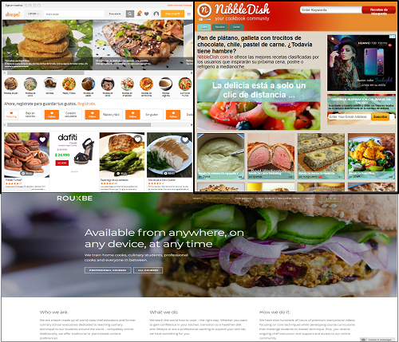
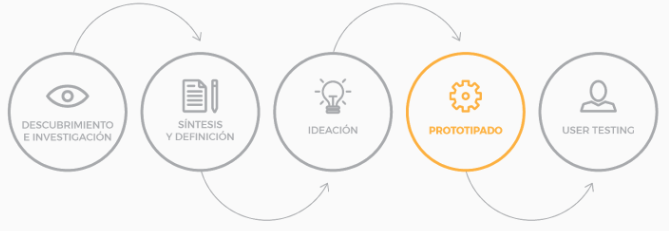
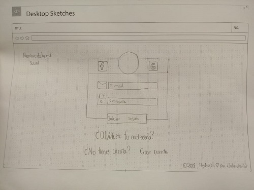
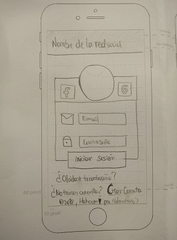
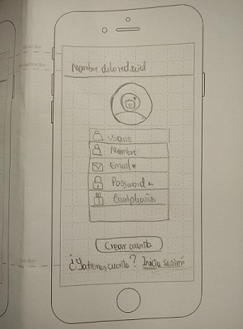
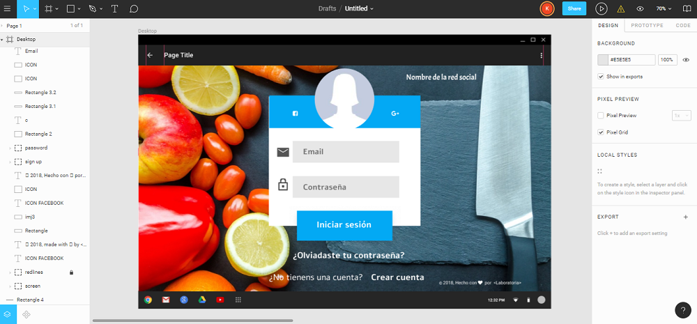
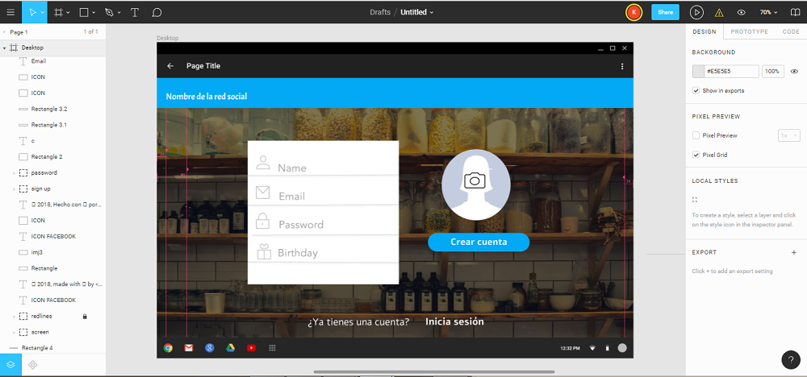

# PROYECTO "SOCIAL NETWORK"

## PREÁMBULO

Instagram, Snapchat, Twitter, Facebook, Twitch, Linkedin, etc. Las redes
sociales han invadido nuestras vidas. Las amamos u odiamos, y muchxs no podemos
vivir sin ellas.

Hay redes sociales de todo tipo y para todo tipo de intereses. Por ejemplo,
en una ronda de financiamiento con inversionistas, se presentó una red social
para químicos en la que los usuarios podían publicar artículos sobre sus
investigaciones, comentar en los artículos de sus colegas, y filtrar artículos
de acuerdo a determinadas etiquetas o su popularidad, lo más reciente, o lo
más comentado.

## INTRODUCCIÓN

Una emprendedora nos ha encargado crear una red social. No nos da mucho detalle
sobre qué tipo de red social quiere, sólo nos dice que creemos la mejor que
podamos, y que luego la convenzamos de lanzarla al mercado. Nos da ciertos temas
en los que le gustaría invertir:

* Alimentación
* Feminismo
* Educación
* Salud
* Energías Renovables

## PLANIFICACIÓN

En este proyecto utilizamos descripciones de los ítems del backlog del producto como "historias de usuario" para organizar el trabajo en función del valor que le aporta al usuario.

### 1 SPRINT

#### Tablero Kanban en trello

#### Tablero Kanban de trabajo por squad

## USER EXPERIENCE

* Cuáles son los elementos básicos que tiene una red social.
* Quiénes son los principales usuarios de producto.
* Cómo descubriste las necesidades de los usuarios.
* Qué problema resuelve el producto para estos usuarios.
* Cuáles son los objetivos de estos usuarios en relación con el producto.
* Cuáles son las principales funcionalidades del producto y cuál es su prioridad.
* Cómo verificaste que el producto les está resolviendo sus problemas.
* Cómo te asegurarás que estos usuarios usen este producto.

La etapa de experiencia del usuario la hemos trabajado según las 5 fases del proceso de diseño:

 ### DESCUBRIMIENTO E INVESTIGACIÓN 

En esta etapa la parte más importante es la de investigar y entender a nuestros usuarios,
 para ello usamos entrevistas con usuarios.

Las preguntas que utilizamos fueron:

* ¿En qué rango de

 ### SINTESIS Y DEFINICION

En esta fase usamos los datos coleccionados y entendemos los deseos y necesidades del público al que estará dirigido nuestro producto.

(STORYTELLING)

 ### IDEACIÓN

En esta fase buscamos las mejores maneras para ejecutar/desarrollar las funcionalidades definidas en la fase de ideación. Para esto hacemos un bechmarking de las principales redes sociales como análisi de competencias:

 ### PROTOTIPADO

En esta etapa elaboramos un prototipo que nos permita probar nuestras ideas con usuarios para saber si estamos resolviendo satisfaciendo sus necesidades con nuestro producto.

  #### Prototipado de baja fidelidad

  El prototipo de baja fidelidad de acuerdo al diseño del login en versiones desktop y movile.

  

  

  

  #### Prototipado de alta fidelidad

 El prototipo de alta fidelidad de acuerdo al diseño del login en la versión desktop, usado para el testeo y elaborado con la herramienta Figma.

### USER TESTING

  #### Feedback

  Como primer feedback de testeo, el usuario comentó que si crea una cuenta nueva entonces debe ser redirigido a la web automáticamente y no a la página de acceso porque crearía demasiada redundancia.

  Como segundo feedback de testeo, el usuario comentó que las letras de "crear cuenta" e "iniciar sesión" deben ser más vistosas pues le era confuso diferenciar su funcionalidad. 

#### 2) Diseño de la Interfaz de Usuario (prototipo de alta fidelidad)

