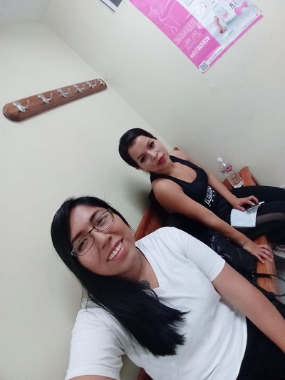
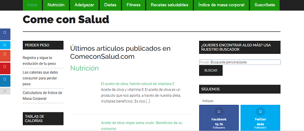
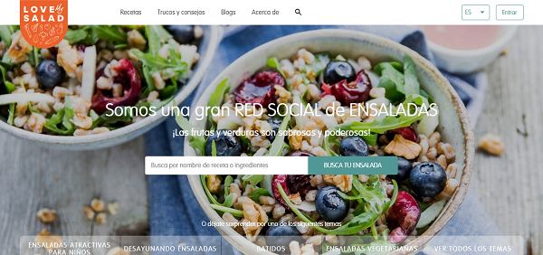

# PROYECTO "SOCIAL NETWORK"

## **INTRODUCCIÓN**

"Nombre de la web" es una red social enfocada en la alimentación de los deportistas, debido a que no cuentan con el tiempo necesario para recopilar los menús saludables requeridos en sus planes de alimentación, en el cual, los usuarios podrán compartir sus recetas, trucos, consejos e ideas novedosas de cocina de manera gratuita.

***

## **PROCESO**

En este proyecto utilizamos descripciones de los ítems del backlog del producto como "historias de usuario" para organizar el trabajo en función del valor que le aporta al usuario.

### **1. PLANFICACIÓN**

En laboratoria, la metodología de trabajo es realizada en squads ( grupos de 6 a 7 personas), con las que puedes dar y recibir feedback constante de tu proyecto.
Debido a que el proyecto fue realizado por un equipo de dos personas, se vio por conveniente utilizar el tablero trello, herramienta necesaria para un seguimiento virtual del progreso.

| **Sprint** | **Tablero Kanban por equipo en trello** | **Tablero Kanban de trabajo por squad** |
| :------- | :------: | -----: |
| Primero  | |    |
| Segundo  |      |      |

### **2. USER EXPERIENCE**

La experiencia del usuario la hemos trabajado según las 5 fases del proceso de diseño:

 #### **2.1. DESCUBRIMIENTO E INVESTIGACIÓN** 
 

En esta etapa la parte más importante es la de investigar y entender a nuestros principales usuarios.

En una rápida investigación, se extrajo diferentes puntos de vista acerca de la nutrición de los deportistas.

>Hay mucho más en la alimentación de los deportistas que ingerir hidratos de carbono o beber bebidas deportivas. La buena noticia es que alimentarte para alcanzar tu rendimiento máximo no significa que debas seguir una dieta especial ni tomar suplementos. Solo consiste en introducir los alimentos adecuados y en las cantidades adecuadas en tu plan de alimentación para estar sano y mantenerte en forma.

>ALIMENTACIÓN. Su otro secreto está quizás en consumir la "comida natural". Gladys Tejeda y los suyos siempre tomaron "agua de maca", y de las más pura, porque sembraban pequeñas hectáreas para su autoconsumo. La carne de cuy, el caldo de rana, la cebada, el morón, la papa y sus derivados (como el chuño), también fueron la base de su alimentación.
Fuente: Diario Correo.

>La ingesta energética debe cubrir el gasto calórico y permitir al deportista mantener un peso corporal adecuado para rendir de forma óptima en su deporte. La actividad
física aumenta las necesidades energéticas y de algunos nutrientes, por ello es importante consumir una dieta equilibrada basada en una gran variedad de alimentos, con el criterio de selección correcto. Además, hay otros factores que condicionan los requerimientos calóricos de cada individuo. 
Fuente: Guia de alimentación, nutrición e hidratación en el deporte, autor: Dra. Nieves Palacios Gil-Antuñano

Con respecto a nuestra investigación, realizamos entrevistas a nuestros posibles usuarios y confirmamos que las personas que practican cualquier tipo de deporte de manera constante, que buscan una guía de alimentación saludable y rápida son nuestros principales usuarios.

**Deportista de natación**

**Deportista de aeróbicos**

**Deportista de baile**

#### **2.2 SINTESIS Y DEFINICION**

En esta fase usamos los datos coleccionados y entendemos los deseos y necesidades del público al que estará dirigido nuestro producto.

Tema: Red social de alimentación para deportistas.

El primer motivo de la elección de este tema fue por experiencia como deportista de una integrante del equipo, luego, debido a que existen tantos sitios webs de alimentación que divulgan información poco confiable, redundante  que abarca el problema del tiempo de preparación y con costos de suscripción, vimos la oportunidad de investigar este tema.

#### **2.3 IDEACIÓN**

En esta fase buscamos las mejores maneras para ejecutar/desarrollar las funcionalidades definidas en la fase de ideación. Para esto hacemos un bechmarking de las principales redes sociales como análisis de competencias:

**Come con Salud**

Es una web de nutrición adaptada a un público general que tiene como contenido notas e informes acerca de la alimentación para adelgazar, remedios naturales, recetas de cocina saudable, consejos y trucos, todo en ayuda de un estilo de vida saludable.

**Nootric**

Es una web de dietas online creadas por nutricionistas profesionales, exclusivo para deportistas, que ayuda a un cambio saludable, eligiendo planes según el perfil requerido. Además añade planes de entrenamiento adapatados al objetivo del usuario.

**Love my salad**

Es una red social de ensaladas que tiene blogs, trucos y consejos, pero sobre todo una sección de recetas en donde al introducir el nombre de cada insumo, la web retorna tips de cómo preparalo, cómo comprarlo, cómo conservarlo y cómo servirlo.

**Strava**

Es una red social para atletas, donde puedes unirte a clubs de tu deporte preferido, añadir actividades, llevar un registro de entrenamiento y grabar tus actividades.

Los comentarios de la applicación demuestran molestias por su costoso sistema y sus continuos mensajes de error al sicronizar sus actividades.

 , 

#### **2.4 PROTOTIPADO**

En esta etapa elaboramos un prototipo que nos permita probar nuestras ideas con usuarios para saber si estamos resolviendo satisfaciendo sus necesidades con nuestro producto.

  **Prototipado de baja fidelidad**

  El prototipo de baja fidelidad de acuerdo al diseño del login en versiones desktop y movile.

| **Prototipos de logueo** | **Vista desktop** | **Vista movile** |
| :-------       |        :------:   |           -----: |
| 1 Prototipo    || |
| 2 prototipo  | |      |

  **Prototipado de alta fidelidad**

 El prototipo de alta fidelidad de acuerdo al diseño del login en la versión desktop, usado para el testeo y elaborado con la herramienta Figma.

#### **2.5 TESTEO CON USUARIOS**

  **Feedback**

  Como primer feedback de testeo, el usuario comentó que si crea una cuenta nueva entonces debe ser redirigido a la web automáticamente y no a la página de acceso porque crearía demasiada redundancia.

  Como segundo feedback de testeo, el usuario comentó que las letras de "crear cuenta" e "iniciar sesión" deben ser más vistosas pues le era confuso diferenciar su funcionalidad. 

***

Luego de completar el proceso de diseño de experiencia del usuario, logramos responder a los requerimientos del proyecto planteados por Laboratoria.

* Cuáles son los elementos básicos que tiene una red social.

* Quiénes son los principales usuarios de producto.

* Cómo descubriste las necesidades de los usuarios.

* Qué problema resuelve el producto para estos usuarios.

* Cuáles son los objetivos de estos usuarios en relación con el producto.

* Cuáles son las principales funcionalidades del producto y cuál es su prioridad.

* Cómo verificaste que el producto les está resolviendo sus problemas.

* Cómo te asegurarás que estos usuarios usen este producto.

***

#### 2) Diseño de la Interfaz de Usuario (prototipo de alta fidelidad)

